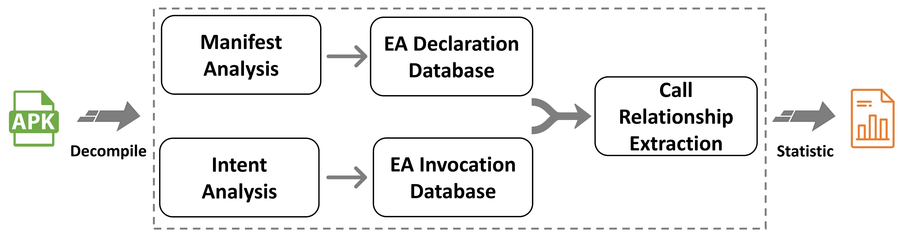

# Mist--MISexposure idenTification for Android

This artifact is for the paper: "Characterizing and identifying misexposed activities in Android applications".  

<p align="center">

</p>

Mist is designed for identifying the misexposed activities in Android apps.

## Publication ##
The paper PDF can be found at https://hanada31.github.io/pdf/ase18_misexpose.pdf
```
@inproceedings{Mist2018,
  author    = {Jiwei Yan and
               Xi Deng and
               Ping Wang and
               Tianyong Wu and
               Jun Yan and
               Jian Zhang},
  editor    = {Marianne Huchard and
               Christian K{\"{a}}stner and
               Gordon Fraser},
  title     = {Characterizing and identifying misexposed activities in Android applications},
  booktitle = {Proceedings of the 33rd {ACM/IEEE} International Conference on Automated
               Software Engineering, {ASE} 2018, Montpellier, France, September 3-7,
               2018},
  pages     = {691--701},
  publisher = {{ACM}},
  year      = {2018},
  url       = {https://doi.org/10.1145/3238147.3238164},
}

```
### Mist = 
### 

### Steps:

#### 1. install swi-prolog.
> sudo apt-get install swi-prolog

#### 2. install python.
> sudo apt-get install python2.7  

#### 3. setting. 
Put the apk under test into folder <i>apk\example</i>. 
If you put apks in other location, modify the variables apk_dir and folder in run.sh

#### 4. run.
> sh run.sh

#### 5. obtain result. 
The result files can be found in the folder <i>result</i>
